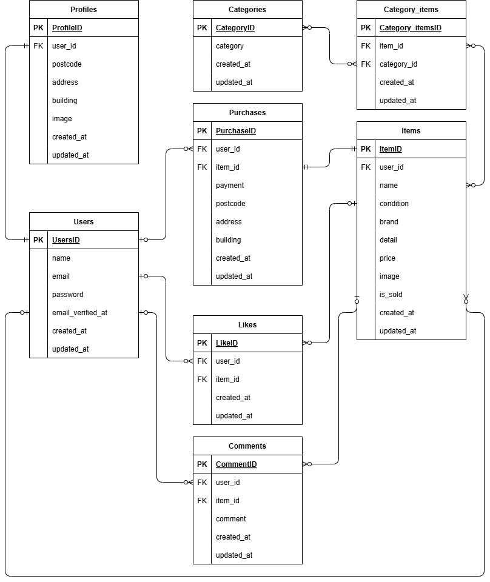

# フリーマーケットアプリケーション

## 環境構築

### Docker ビルド

1. GitHub リポジトリをローカル環境にコピー

```bash
git git clone git@github.com:orochan89/flea-market-app.git
```

2. Docker コンテナのビルドと起動(バックグラウンド)

```bash
docker compose up -d --build
```

### Laravel 環境構築

1. PHP コンテナに入る

```bash
docker-compose exec php bash
```

2. 依存パッケージをインストール

```bash
composer install
```

3. .env.example をコピーして .env を作成

```bash
cp .env.example .env
```

4. .env 内の環境変数を以下の通り変更

```env
DB_CONNECTION=mysql
DB_HOST=mysql
DB_PORT=3306
DB_DATABASE=laravel_db
DB_USERNAME=laravel_user
DB_PASSWORD=laravel_pass
```

```env
MAIL_MAILER=smtp
MAIL_HOST=mailhog
MAIL_PORT=1025
MAIL_USERNAME=null
MAIL_PASSWORD=null
MAIL_ENCRYPTION=null
MAIL_FROM_ADDRESS=noreply@example.com
MAIL_FROM_NAME="${APP_NAME}"
```

5. アプリケーションキーを生成

```bash
php artisan key:generate
```

6. データベースのマイグレーションを実行

```bash
php artisan migrate
```

7. 初期データのシーディングを実行

```bash
php artisan db:seed
```

8. ストレージディレクトリのシンボリックリンクを作成

```bash
php artisan storage:link
```

## 作成済みユーザー情報

スタッフ画面ログイン用  
Email : test@example.com  
Password : password

## メール認証

MailHog を使用  
http://localhost:8025/

## 使用技術

・ php 8.1  
・ Laravel 8.\*  
・ MySQL 8.0.26  
・ JavaScript  
・ MailHog

## ER 図



## URL

・ 開発環境 : http://localhost/  
・ phpMyAdmin : http://localhost:8080/  
・ MailHog : http://localhost:8025/

## テスト実行用の環境構築

### テスト用 .env.testing ファイルの作成

1. PHP コンテナに入る

```bash
docker-compose exec php bash
```

2. .env をコピーして .env.testing を作成 **開発環境構築で作成した .env ファイルをコピーする事**

```bash
cp .env .env.testing
```

3. .env.testing 内の環境変数を以下の通り変更

```env
APP_NAME=Laravel
APP_ENV=test
APP_KEY=
APP_DEBUG=true
APP_URL=http://localhost
```

```env
DB_CONNECTION=mysql
DB_HOST=mysql
DB_PORT=3306
DB_DATABASE=demo_test
DB_USERNAME=root
DB_PASSWORD=root
```

### テスト用データベースの作成

1. MYSQL コンテナに入る

```bash
docker-compose exec mysql bash
```

2. MYSQL にログイン

```bash
mysql -u root -p
```

3. MYSQL パスワードを入力

```bash
root
```

4. テスト用データベースを作成

```bash
CREATE DATABASE demo_test;
```

### テスト環境のセットアップ

1. PHP コンテナに入る

```bash
docker-compose exec php bash
```

2. アプリケーションキーを生成

```bash
php artisan key:generate --env=testing
```

3. 設定キャッシュを削除

```bash
php artisan config:clear
```

4. 初期データのシーディングを実行

```bash
php artisan migrate --env=testing
```

### テストの実行

1. テストの実行

```bash
php artisan test
```
